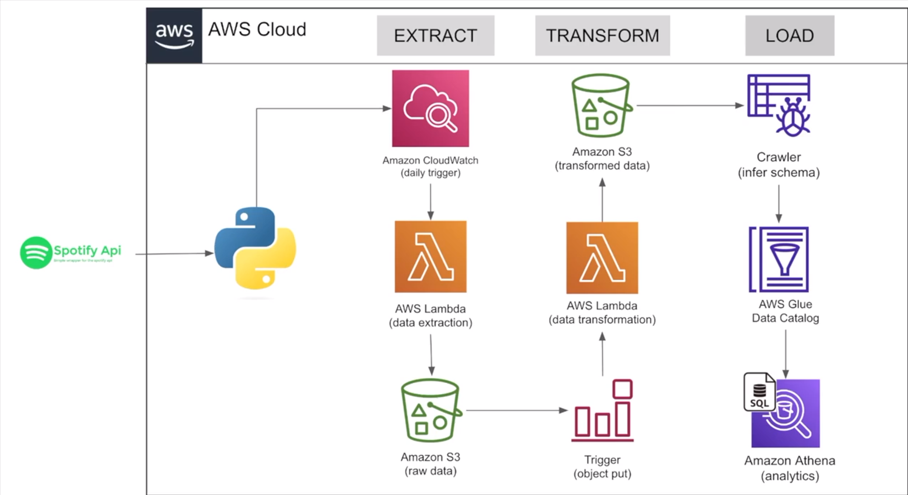

<p align="center">
  
</p>

<h1 align="center">🎧 Spotify Data Pipeline using AWS</h1>

<p align="center">
  A serverless ETL pipeline to extract data from the Spotify API, transform it using AWS Lambda, and analyze it with Amazon Athena.
</p>

<p align="center">
  <a href="https://github.com/yourusername/spotify-data-pipeline/commits/main">
    
  </a>
  <a href="https://github.com/yourusername/spotify-data-pipeline/issues">
    
  </a>
  <a href="https://github.com/yourusername/spotify-data-pipeline/blob/main/LICENSE">
    
  </a>
</p>

---

## 🏗️ Architecture Overview

The pipeline architecture follows the **ETL (Extract, Transform, Load)** pattern using a fully serverless stack:



---

## 🧰 Tech Stack

| Service/Tool       | Role                                                   |
|--------------------|--------------------------------------------------------|
| **AWS Lambda**     | Serverless functions for data extraction & transformation |
| **Amazon S3**       | Storage for raw and processed data                     |
| **Amazon CloudWatch** | Scheduled Lambda invocations                         |
| **AWS Glue**       | Schema inference via Crawlers, and Data Catalog        |
| **Amazon Athena**  | SQL querying for analysis                              |
| **Spotify API**    | Data source for music-related metadata                 |
| **Python**         | Language used for scripting pipeline logic             |

---

## ⚙️ ETL Workflow

### 🔍 Extract

- **Trigger**: Scheduled via Amazon CloudWatch (e.g., daily at midnight)
- **Lambda Function (Extractor)**:
  - Authenticates with the Spotify API
  - Retrieves data such as top tracks, artists, and playlists
  - Stores raw JSON data in an **S3 bucket** (e.g., `spotify-data/raw/`)

### 🔄 Transform

- **Trigger**: S3 event notification on new raw data
- **Lambda Function (Transformer)**:
  - Cleans and restructures the data
  - Writes transformed output to a separate **S3 bucket** (e.g., `spotify-data/processed/`)

### 🚀 Load

- **AWS Glue Crawler**:
  - Crawls the transformed data and updates the **Glue Data Catalog**
- **Amazon Athena**:
  - Enables SQL queries on top of the transformed data using the schema defined by Glue

---

## 🚀 Getting Started

### ✅ Prerequisites

Before you begin, ensure you have the following:

- An active **AWS account**
- **IAM roles** with permissions for Lambda, S3, Glue, CloudWatch, and Athena
- **Spotify Developer account** with access to API credentials
- **Python 3.8+** installed locally

### 📦 Clone the Repository

```bash
git clone https://github.com/yourusername/spotify-data-pipeline.git
cd spotify-data-pipeline
````

### 🔐 Set Up Environment Variables

Set your Spotify API credentials in a `.env` file or use AWS Secrets Manager:

```
SPOTIFY_CLIENT_ID=your_client_id
SPOTIFY_CLIENT_SECRET=your_client_secret
```

### 🛠️ Deploy the Pipeline

1. Package your Lambda functions
2. Deploy using the AWS Console or AWS CLI
3. Set up CloudWatch trigger and S3 events
4. Run the pipeline manually or wait for the schedule

---

## 📈 Example Queries in Athena

```sql
-- Top 10 most streamed tracks
SELECT track_name, artist_name, play_count
FROM spotify_tracks
ORDER BY play_count DESC
LIMIT 10;
```

---

## 📂 Project Structure

```bash
spotify-data-pipeline/
│
├── extract_lambda.ipynb     # Lambda function to fetch data from Spotify
├── transform_lambda.ipynb   # Lambda function to clean and process data
├── Spotify_data_Pipeline    # Example codes of lambda functions
├── requirements.txt         # Python dependencies
├── README.md                # Project documentation
└── Capture.PNG              # Architecture diagram
```

---

## 🤝 Contributing

Contributions are welcome! If you find a bug or have a feature request:

1. Fork the repository
2. Create a new branch (`git checkout -b feature/your-feature`)
3. Commit your changes (`git commit -m 'Add new feature'`)
4. Push to the branch (`git push origin feature/your-feature`)
5. Open a Pull Request

---

## 📄 License

This project is licensed under the [MIT License](LICENSE).

---

## 🙋‍♂️ Acknowledgments

* [Spotify for Developers](https://developer.spotify.com/)
* [AWS Documentation](https://docs.aws.amazon.com/)


